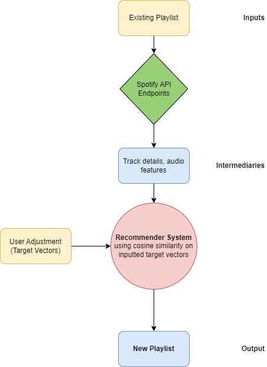
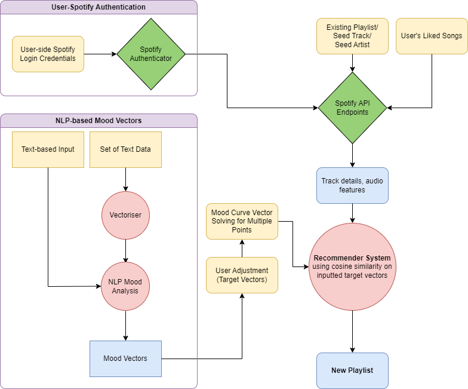

# GA Capstone: Spotify Playlist Generator
This project aims to create a spotify playlist generator that can sequence songs from a seed playlist following a mood vector.  

## Background of Music, Spotify
Spotify's role in the music industry needs no introduction - founded in 2006, it is a company that has become entrenched in how most people browse, discover, and enjoy music, both new and old. Initially meant as an answer to yester-decade's music file-sharing piracy issues, it now boasts over 450 million active users, with just under 200 million of them paid subscribers of the platform, and beating out its competition for market share that popped up in its wake, such as Apple Music, Youtube Music, and Amazon. 

For a more recent summary about Spotify, you may read [CNBC's recent commentary here](https://www.cnbc.com/2022/11/10/how-spotify-stayed-no-1-in-streaming-music-vs-apple-youtube-amazon.html).

Since its inception, the company has not been without controversy, bumping heads with the likes of industry giants like Taylor Swift and more recently Neil Young, about the platform's meager royalty payment terms and other socio-political issues. Still, the company remains largely a staple in the world of music, and has made listening to music that much more accessible for the average consumer.

## Project Statement
Spotify already has a robust recommendation system, and this usually comes in the form of procedurally generated, user-tailored playlists to a person's taste. 

But this comes with a catch.

Spotify likes to recommend you songs that are new, and keep you listening and discovering new music. While this is a great way to find 'new digs', it does not allow you to intuitively create playlists from a known pool of songs - say for example from your saved songs. 

**The solution**: To create a playlist recommender that operates from **within** a given song pool, say from an existing playlist, or from a user's liked songs.

## Current Project Architecture

### Summary of data collected from Spotify endpoints
Given what we need for markers for our recommender, we will need to pull from three API endpoints, namely:
1. A track list source - for now this is only from **predefined or Spotify-generated playlists**;
2. Genre information, which is available from the artists' metadata, and;
3. From its audio features.

From the track, we will pull all of its audio features to get metrics useful for matching mood markers, as well as other details like the name, list of artists, and album which the track came from. This recommender is intended to be **version-agnostic**, that is to say that different versions of the same song are treated as different, perfectly viable, unique songs. That being said, we will of course not include multiple versions of the same track in the end-playlist generation. That is just bad form.

Note: Due to time limiation, the genre information is not utilize in the current version of the app, but will be useful for future upgrades.

### Markers for Recommender Evaluation
1. Mood markers: `danceability`, `energy`, `valence`, `tempo`, `acousticness`, `loudness`
2. Song similarity markers: all mood markers, `speechiness`, `acousticness`, `instrumentalness`, `liveness`
3. Music metadata: `key`, `mode`, `duration_ms`, `time_signature`

Considerations:
1. `Acousticness` is not a direct measure of mood/energy, but in general acoustic songs tend to be lower on the energy scale. This is represented by a strong inverse correlation with `loudness` and `energy`.
2. `Loudness` too is somewhat representive of mood (*high energy ~ louder*).
3. `Valence`, according to Spotify's documentation, is "*a measure from 0.0 to 1.0 describing the musical positiveness conveyed by a track. Tracks with high valence sound more positive (e.g. happy, cheerful, euphoric), while tracks with low valence sound more negative (e.g. sad, depressed, angry)*".1  
`Valence` is loosely correlated to `danceability`, `energy`, and `loudness`.

4. Music metadata is generally unuseful for the recommender engine; `key`/`mode`/`duration_ms`/ `time_signature` are not really related to the *feel* of a song, just its composition. The one niche exception would be `duration_ms`, since in particular looking for radio-edit songs means you can reasonably assume the songs you want are below a certin duration (*most radio shows have a softcap of around 3mins per song*). This is however more useful as a censor than as a metric. For the scope of this project, the duration will be left out.
5. Song similarity markers are important too, as they tell us how similar each **consecutive** song is to the previous/next one.

1 Testing this by filling a playlist with the highest valence values (and another with the lowest), I find this is somewhat true - although there is also a certain element of nuance to it. If we have learnt anything from Disney's hit animation film "*Inside Out*", emotions are hardly a 1-dimensional spectrum, and oftentimes exist (*and are expressed*) with other emotions concurrently. For e.g., songs in the lowest valence pool tend to be songs with more complicated emotional 'stories'; perhaps descriptors like 'bittersweet' or 'melancholic' would better describe them than just 'sad', and 'excited', 'edgy', or 'provacative' for 'happy'. Still, it does its job as a generalised mood metric.

### Data Cleaning

#### 1. Removing 'True' Duplicates
Finding 'true' duplicates - we need to consider the following:
1. Songs by different artists with the same name
2. Some songs are re-released on other albums, so will have different unique identifiers

#### 2. Convert Boolean fields into int
Converting `Available` and `Explicit` boolean features to integer.

`Available` reflects whether the song is available for consumption in a given market that Spotify services, while `Explicit` is a switch tagged to songs with expletives and vulgarities.

This is done for future consideration of the recommender engine, if the model is to be considered for deployment to users in different markets; it is not yet currently useful.

### Preprocessing

#### 1. Drop Irrelevant Columns
1. **`Album`**: not that important, as it often contains little information about the song itself.
2. **Music markers**: `key`,`mode`,`time_signature`,`duration_ms`
3. **All uris and urls except for** `track_uri`
4. `Available` **and** `Explicit`

#### 2. Vectorize the Genre Column
Note that only Genre is vectorized, and not Artist/Collaborator names, as trying to gain some insights from the name of bands and artists will only be noise to the model.

As mentioned before, while Genre is not used in the current version of the app, it will be useful for future developments.

#### 3. Scaling Our Numerical Features
This is important to give these features equal weightage for the cosine similarity to prioritise each metric individually and equally.

#### 4. Creating mood vectors
For now, we take the average of relevant mood vectors (scaled) to get our generic mood vectors. We will need to aggregate some usable vectors from what Spotify provides us with.

Mood markers - a quick recap:   
`danceability` - How danceable a song is (*roughly*).  
`energy` - How exciting/moving the music is.  
`valence` - A measure of positivity of the song (*high emotional valence = more 'happy'-sounding it is*).  
`tempo` - beats-per-minute.  
`acousticness` - How 'stripped down' the instrumentation is - think Ed Sheeran or Jason Mraz.  
`loudness` - decibels  

Considering the following engineered features:  
[1] Impact(mellow/excited)
* a more robust version of `energy`, accounting for `loudness`, `tempo`, and (-ve) `acousticness` 

[2] Hype I can only describe this metric as how 'catchy' some music is`valence`, `energy`, `tempo`, secondaries: `danceability`, `loudness`  
[3] Vibes - mostly `danceability`, but taking into account to a small extent other meta factors like `energy`, absolute `valence` value (standard scaled), and (-ve) `loudness`.

### Running Cosine Similarity using a test vector
Using cosine similarity (or in more general terms, a distance vector for similarity) seems like the obvious choice in this case, since we are dealing with a content-based filtering model to figure out what the closest songs would be for any given target vector. Some considerations:

1. Drop columns from the model that are not given a vector; this way the similarity will only consider the inputted values, and thus how close they are in terms of the supplied vectors.
2. While the overall end-goal is to have a model that can use similarity taking into consideration all relevant features, for the purposes of creating a base playlist this is not needed. (thinking about drop features, and genre vectorisation)

## Conclusions
The model performs fairly well in generating new playlists from a certain pool, following various mood vectors inputted. 

## Further Considerations and Future Additions
In no order of merit:
1. App cloud deployment
2. Create a playlist that follows a 'mood curve' - Creating interpolated mood vectors between multiple solved mood points
3. Sequencing playlist based on user's liked songs
4. Text-based hype/vibe assignment using NLP models
5. Sequencing based on a song or artist seed
6. Pull from more than one playlist

## Future Work Roadmap
